<p align="center">
 
 <h1 align="center">数据挖掘</h1>
 <p align="center"><b>Jupyter、Matplotlib、Numpy、Pandas</b></p>
</p>


<div align=center>


[](LICENSE)


</br>


<div align=left>
<!-- 顶部至此截止 -->


[toc]


# 环境安装

| 库         | 说明                                                         |
| ---------- | ------------------------------------------------------------ |
| Matplotlib | 可以借助它进行绘制柱状图、折线图、散点图、直方图、函数图像等 |
| Numpy      |                                                              |
| Pandas     | 可以用于数据清洗                                             |
| TA-Lib     | 技术指标库                                                   |
| Tables     | 读取某一种数据文件（hdf5 - 经过压缩的一种数据文件）          |
| Jupyter    | 数据分析与展示的平台                                         |


# Jupyter Notebook

## 简介

**Jupyter Notebook 可以理解为 web 版本的 iPython**

Jupyter项 目是一个非盈利的开源项目，源于2014年的Python项目，并逐渐发为支持跨所有编程语言的交互式数据科学计算的工具。

- JupyterNotebook，原名 ipython Notebook，是 iPython 的加强网页版，一个开源Web应用程序
- 名字源自 Julia、 Python 和 R（数据科学的三种开源语言）
- 是一款程序员和科学工作者的编程/文档/笔记/展示软件
- `ipynb` 文件格式是用于计算型叙述的 **JSON文档格式**的正式规范


**为什么使用 Jupyter Notebook？**

- 画图和展示数据方便


## cell 操作

**cell：一对 In-Out 会话被视作一个代码单元，称为 cell**

Jupyter 支持两种模式：

- 编辑模式（ Enter）
    - 命令模式 下`回车 Enter` 或 `鼠标双击 cell` 进入编辑模式
    - 可以操作 cell 内文本或代码，剪切/复制/粘贴移动等操作
- 命令模式（Esc）
    - 按Esc退出编辑，进入命令模式
    - 可以操作 cell 单元本身进行剪切/复制/粘贴/移动等操作


## 使用 Jupyter Notebook

| 功能                                 | 快捷键                                               |
| ------------------------------------ | ---------------------------------------------------- |
| 打开 Jupyter Notebook                | 终端中输入：`jupyter notebook` 或 `ipython notebook` |
| 运行此单元格的代码，并自动选择下一个 | Shift + Enter                                        |
| 运行此单元格的代码，留在此单元       | Ctrl + Enter                                         |
|                                      |                                                      |


| 命令模式下（ESC 进入） | 操作                        |
| ---------------------- | --------------------------- |
| A                      | 在当前 cell 上面插入新 cell |
| B                      | 在当前 cell 下面插入新 cell |
| 双击D                  | 删除当前 cell               |


| 编辑模式下（Enter 进入）  | 操作       |
| ------------------------- | ---------- |
| Ctrl + / 或 CMD + /       | 添加注释   |
| 按住 Alt 或 Option 点鼠标 | 多光标操作 |
| Tab                       | 补全代码   |


# Matplotlib


## 简介


**名字：**

- mat - matrix
- plot - 画图
- lib - library


**功能：**

- 专门用于开发 2D 或 3D 图表的 Python 库
- 使用起来极其简单
- 以渐进、交互式方式实现数据可视化


**为什么学习 Matplotlib**

将数据可视化，更直观的呈现；在我们进行数据挖掘和分析之前可以帮助我们选择一个更加适合的方法。

言外话：在 JavaScript 中好用的数据可视化工具有 D3 和 百度的 echarts


## 图像结构

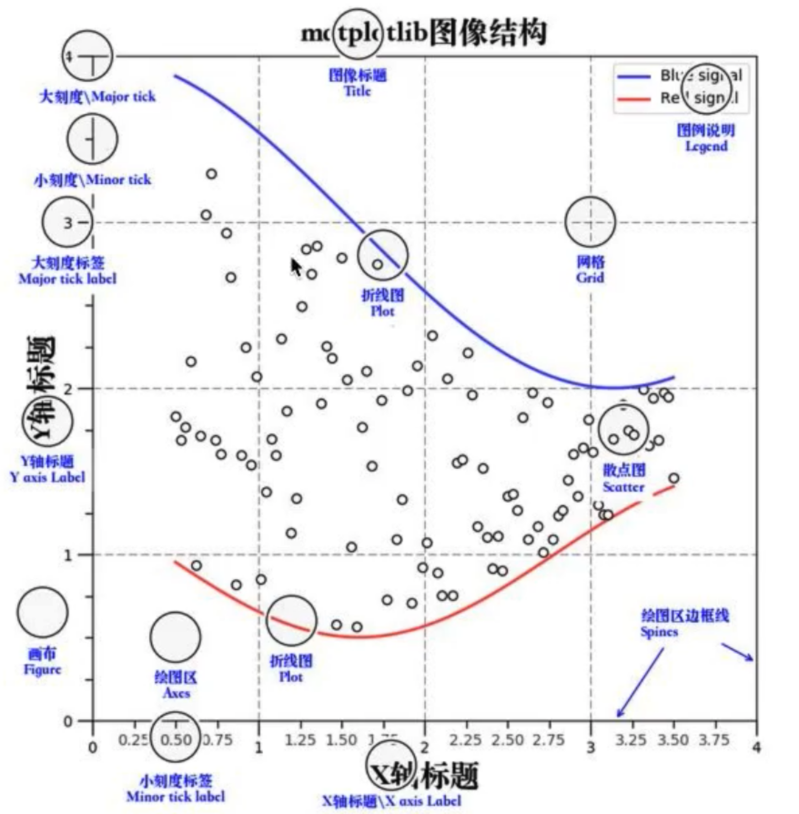


## Matplotlib 三层结构

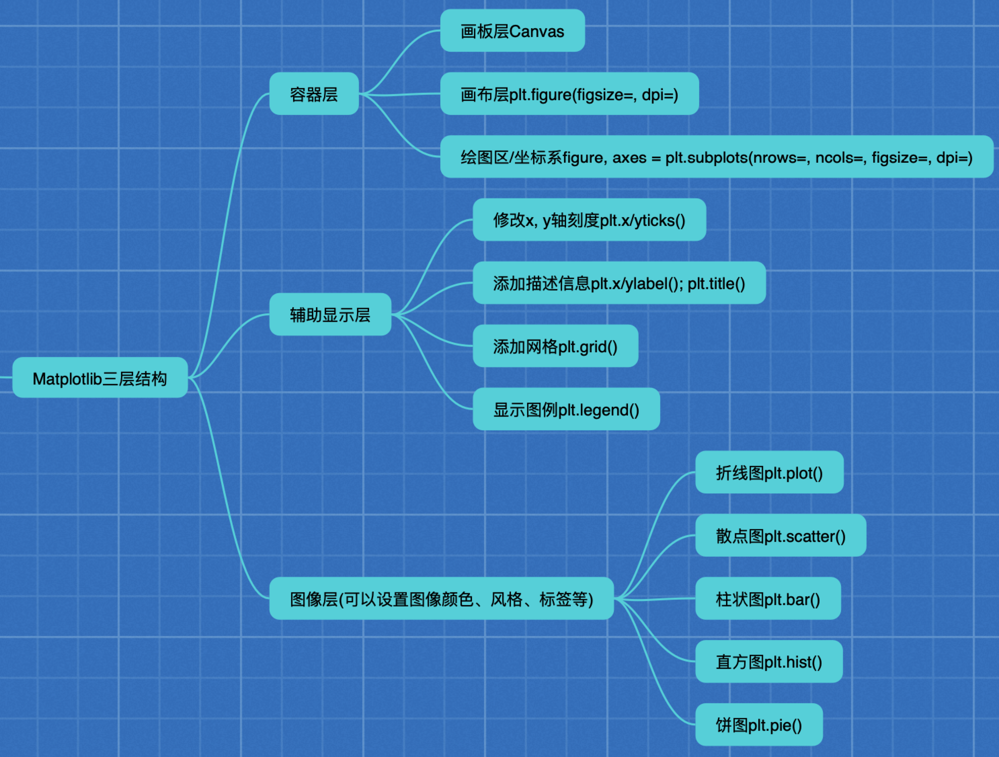


**由底向高：**

- **画板层（Canvas）**

​	Canvas 是位于最底层的系统层，在绘图的过程中充当画板的角色，即放置画布（Figure）的工具。


- **画布层（Figure）**

    Figure 是 Canvas 上方的*第一层*，也是需要用户来操作的应用层的第一层，在绘图的过程中充当画布的角色

    **创建或设置画布**：`plt.figure()`

    

- **绘图区/坐标系（Axes）**

    Axes 是应用层的第二层，在绘图的过程中相当于画布上的绘图区的角色

    画布上是默认有一个绘图区，一个绘图区是有 x、y 轴张成的区域

    手动创建新的话：`plt.subplots()`

    - **图像层**

        每一个绘图区上的不同图像层都可以画不同的图表

        图像层指 Axes 内通过 plot、scatter、bar、hist、pie 等函数根据数据绘制出的图像

        

    - **辅助显示层**

        图像上的那些坐标、网格、辅助线等。辅助图像的显示

        辅助显示层为 Axes（绘图区）内的除了根据数据绘制出的图像以外的内容，主要包括 Axes外观（facecolor）、边框线（spines）、坐标轴（axis）、坐标轴名称（axis labe）、坐标轴刻度（tick）、坐标轴刻度标签（tick label）、网格线（grid）、图例（legend）、标题（title）等内容

        该层的设置可使图像显示更加直观更加容易被用户理解，但又不会对图像产生实质的影响


**特点：**

- 一个 figure（画布）可以包含多个 axes（坐标系/绘图区），但是一个 axes 只能属于个 figure
- 一个 axes（坐标系/绘图区）可以包含多个 axis（坐标轴），包含两个即为2d坐标系，3个即为3d坐标系


**总结：**

- Canvas（画板）位于最底层，用户一般接触不到
    - Figure（画布）建立在 Canvas 之上
        - Axes（绘图区）建立在 Figure之上
            - 坐标轴（axis）、图例（legend）等辅助显示层以及图像层都是建立在 Axes 之上

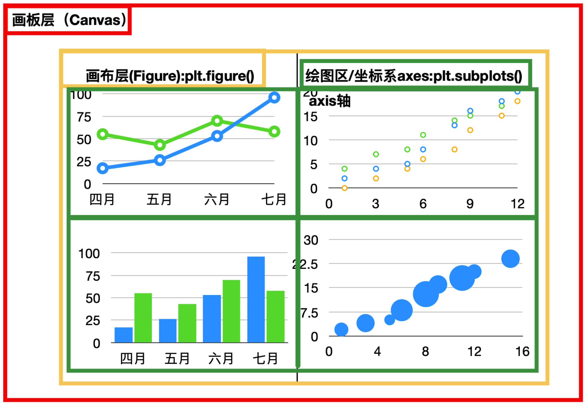

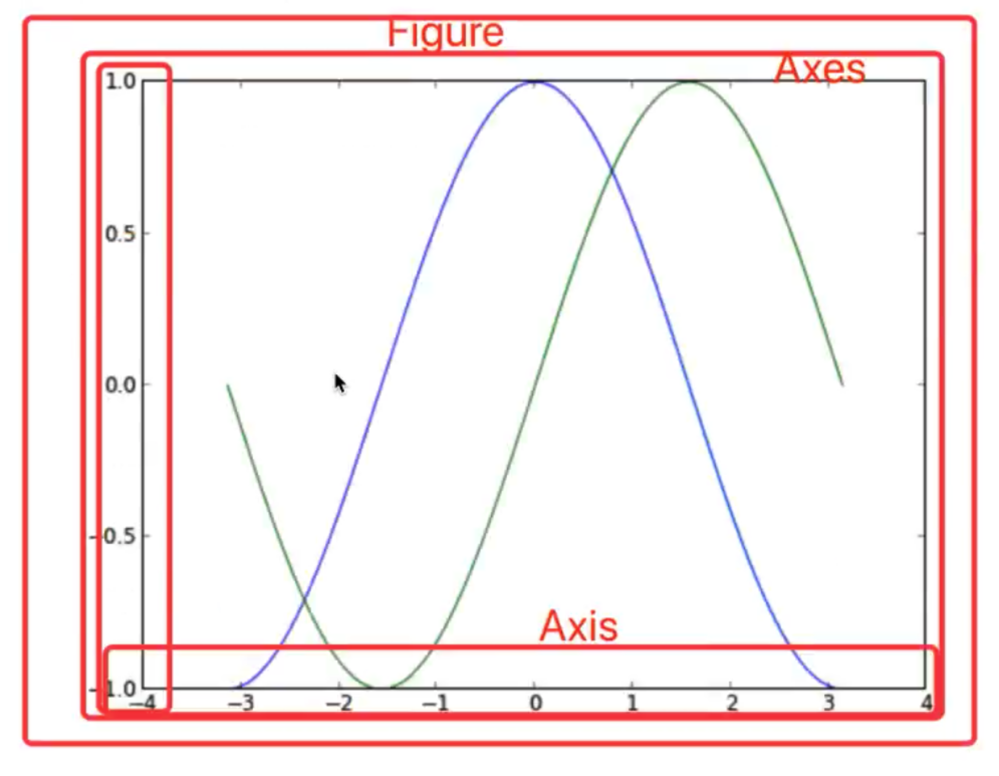


## 绘图

`matplotlib.pytplot` 包含了一系列类似于 matlab 的画图函数。他的函数作用于当前图形（figure）的当前坐标系（axes）

```python
 import matplotlib.pyplot as plt
```


| 中文   | 英文      |
| ------ | --------- |
| 折线图 | plot      |
| 散点图 | scatter   |
| 柱状图 | bar       |
| 直方图 | histogram |
| 饼图   | pie       |


---


## 折线图（plot）与基础绘图功能

### API

| API                                         | 功能                           | 参数                                 |
| ------------------------------------------- | ------------------------------ | ------------------------------------ |
| `plt.figure(figsize=(x, y), dpi=y轴分辨率)` | 创建画布                       |                                      |
| `plt.plot(x轴数据列表, y轴数据列表)`        | 绘制图像                       |                                      |
| `plt.xticks(x要显示的刻度列表, **说明)`     | 添加自定义 x 刻度              |                                      |
| `plt.yticks(y要显示的刻度列表, **说明)`     | 添加自定义 y 刻度              |                                      |
| `plt.title('说明字符串')`                   | 添加标题                       |                                      |
| `plt.xlabel('说明字符串')`                  | 添加 x 轴说明                  |                                      |
| `plt.ylabel('说明字符串')`                  | 添加 y 轴说明                  |                                      |
| `plt.grid(True, linestyle='--', alpha=0.5)` | 添加网格显示                   | `linestyle`-线条风格；`alpha`-透明度 |
|                                             |                                |                                      |
|                                             |                                |                                      |
| `plt.savefig('路径')`                       | 保存图像                       |                                      |
| `plt.show()`                                | 显示图像，并释放画布的所有资源 |                                      |


### 图形风格

| 颜色字符 | 风格字符        |
| -------- | --------------- |
| r 红色   | `-` 实线        |
| g 绿色   | `--` 虚线       |
| b 蓝色   | `-.` 点划线     |
| w 白色   | `:`点虚线       |
| c 青色   | `''` 留空、空格 |
| m 洋红   |                 |
| y 黄色   |                 |
| k 黑色   |                 |


### 显示图例

> 注意:如果只在 `plt.plot()`中设置 label 还不能最终显示出图例，还需要通过 `plt.legend()` 将图例显示出来。

```python
 # 绘制折线图
plt.plot(x, y_shanghai, label="上海")

# 使用多次plot可以画多个折线
plt.plot(x, y_beijing, color='r', linestyle='--', label="北京")

# 显示图例
plt.legend(loc="best")
```


**图例位置：**

| **Location String** | **Location Code** |
| ------------------- | ----------------- |
| 'best'              | 0                 |
| 'upper right'       | 1                 |
| 'upper left'        | 2                 |
| 'lower left'        | 3                 |
| 'lower right'       | 4                 |
| 'right'             | 5                 |
| 'center left'       | 6                 |
| 'center right'      | 7                 |
| 'lower center'      | 8                 |
| 'upper center'      | 9                 |
| 'center'            | 10                |


### 多个坐标系显示 plt.subplots(面向对象的画图方法)

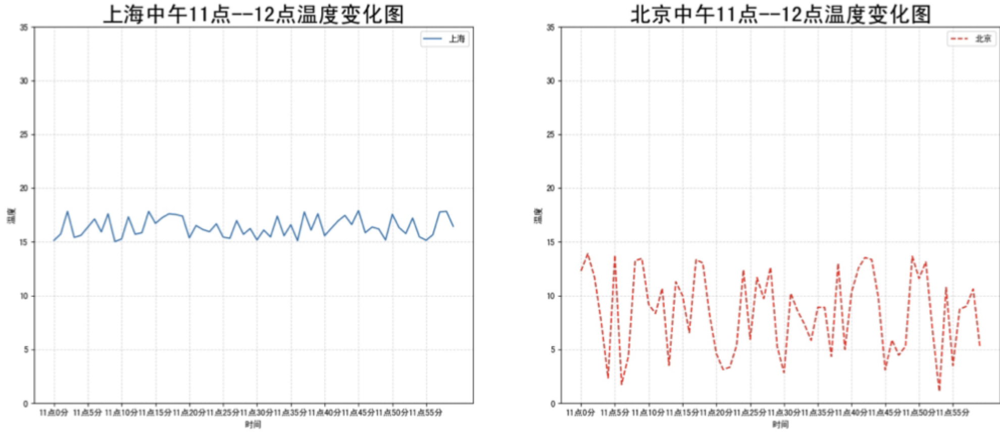


可以通过subplots函数实现(旧的版本中有subplot，使用起来不方便)，推荐subplots函数


**API:**

`matplotlib.pyplot.subplots(nrows=列数, ncols=行数, **fig_kw) ` 创建一个带有多个axes(坐标系/绘图区)的图

返回值：

- figure : 图对象
- axes : 返回相应数量的坐标系

之后在调用的时候，也不能直接使用 `plt.方法名()` 了，要用返回的 `ares[索引].set_方法名()` 

另外，在这种多坐标系显示的情况下，设置标题的方式也有所不同：

技巧：基本是涉及到辅助显示层的都要加 `set_`

- set_xticks 
- set_yticks 
- set_xlabel
- set_ylabel

> 参考：https://matplotlib.org/api/axes_api.html#matplotlib.axes.Axes


### 应用场景

`plt.plot()` 除了画折线图还可以画各种数学函数图像

```python
# 准备数据
import numpy as np
from matplotlib import pyplot as plt

x = np.linspace(-1, 1 , 1000)
y = 2 * x * x

# 创建画布
plt.figure(figsize=(20, 8), dpi=80)

# 绘制图像
plt.plot(x, y)

# 添加网格显示
plt.grid(linestyle='--', alpha=0.7)

# 显示图像
plt.show()
```


---


## 散点图（scatter）

简单示例：

```python
from matplotlib import pyplot as plt

"""
探究房屋面积和房屋价格的关系
x - 房屋面积
y - 房屋价格
"""
# 准备数据
x = [225.98, 247.07, 253.14, 457.85, 241.58, 301.01, 20.67, 288.64, 163.56, 120.06, 207.83, 342.75, 147.9 , 53.06, 224.72, 29.51,
21.61, 483.21, 245.25, 399.25, 343.35]

y = [196.63, 203.88, 210.75, 372.74, 202.41, 247.61, 24.9 , 239.34, 140.32, 104.15, 176.84, 288.23, 128.79, 49.64, 191.74, 33.1 ,
30.74, 400.02, 205.35, 330.64, 283.45]

# 新建画布
plt.figure(figsize=(20, 8), dpi=100)

# 绘制散点图
plt.scatter(x, y)

# 展示图像
plt.show()
```


---


## 柱状图（bar）

```python
from matplotlib import pyplot as plt

# 对比每部电影的票房收入
 
# 准备数据
x_moives = ['雷神3:诸神黄昏','正义联盟','东方快车谋杀案','寻梦环游记','全球风暴', '降魔传','追捕','七十七天','密战','狂兽','其它']
y_tickes = [73853,57767,22354,15969,14839,8725,8716,8318,7916,6764,52222]

# 创建画布
plt.figure(figsize=(20, 8), dpi=80)

# 绘制柱状图
x = range(len(x_moives))
plt.bar(x, y_tickes, width=0.5, color=['b','r','g','y','c','m','y','k','c','g','b'])

# 辅助显示层
plt.title('2017年票房对比')
plt.xticks(x, x_moives)
plt.grid(linestyle='--', alpha=0.5)

# 显示
plt.show()
```


---


### 平移坐标以显示多个柱子


- **如果要想实现在一个分类里显示两个柱状图，本质上是在绘制时把柱子和坐标平移！**

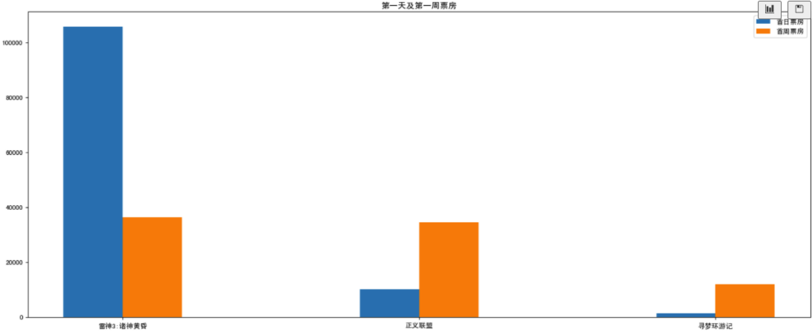

```python
from matplotlib import pyplot as plt


# 准备数据
movie_name = ['雷神3:诸神黄昏','正义联盟', '寻梦环游记']
first_day = [105786.3, 10063.5, 1278.3]
first_weekend = [36224.9, 34486.6, 11863]

# 创建画布
plt.figure(figsize=(20, 8), dpi=80)

# 绘制柱状图
"""
【重点】要想在一个分类里显示两个，其实是把第二个柱状图给平移了一下，避免两个柱状图挡在一起
 这里用一个列表生成式进行书写
""" 
x = range(len(movie_name))
plt.bar(x, first_day, width=0.2, label='首日票房')
plt.bar([i + 0.2 for i in x], first_weekend, width=0.2, label='首周票房')
plt.legend()  # 显示图例

# 辅助显示层
plt.title('第一天及第一周票房')
plt.xticks([i + 0.1 for i in x], movie_name)  # 【重点】修改刻度，这里的列表生成式其实是把刻度给平移了

# 展示
plt.show()
```


---


## 直方图（histogram）

直方图（histogram）用于反映数据的分布状况

直方图，形状类似柱状图却有着与柱状图完全不同的含义。直方图涉统计学的概念，首先要对数据进行分组，然后统计每个分组内数据元的数量。在坐标系中，轴标出每个组的端点，纵轴表示频数，每个矩形的高代表对应的频数，称这样的统计图为频数分布直方图。


**直方图与柱状图分区别：**

- 直方图展示的是数据的分布，柱状图比较数据的大小

- 直方图 x 轴为定量数据、数据是连续的，柱状图 x 轴为分类数据。所以直方图的每根柱子是不可移动的

    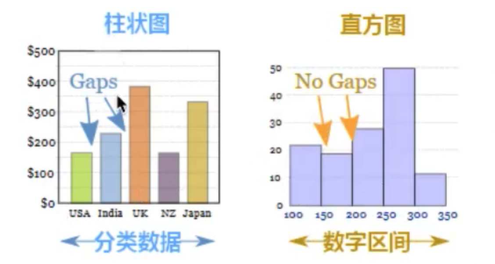

- 直方图的柱子是无间隔的，柱状图柱子有间隔

- 直方图的柱子宽度可不一样，柱状图柱子宽度必须一样


**API:**

```python
matplotlib.pyplot.hist(x, bins=None, density=False, **kwargs)

其中：
	- `x` 就是我们的数据
    - `bins` 就是组数
    - `density` 是否显示频率
```


**【重要】要绘制直方图的过程**

1. 设置组距
2. 设置组数（通常对于数据较少的情况，分为 5~12 组；数据较多，更换图形显示方式）
    - *组数 = 极差/组距 = (Max - Min) / 组距*
3. 要注意 y 轴表示的是什么


示例：

```python
# 电影时长的分布状况
from matplotlib import pyplot as plt

# 准备数据
time = [131,  98, 125, 131, 124, 139, 131, 117, 128, 108, 135, 138, 131, 102, 107, 114, 119, 128, 121, 142, 127, 130, 124, 101, 110, 116, 117, 110, 128, 128, 115,  99, 136, 126, 134,  95, 138, 117, 111,78, 132, 124, 113, 150, 110, 117,  86,  95, 144, 105, 126, 130,126, 130, 126, 116, 123, 106, 112, 138, 123,  86, 101,  99, 136,123, 117, 119, 105, 137, 123, 128, 125, 104, 109, 134, 125, 127,105, 120, 107, 129, 116, 108, 132, 103, 136, 118, 102, 120, 114,105, 115, 132, 145, 119, 121, 112, 139, 125, 138, 109, 132, 134,156, 106, 117, 127, 144, 139, 139, 119, 140,  83, 110, 102,123,107, 143, 115, 136, 118, 139, 123, 112, 118, 125, 109, 119, 133,112, 114, 122, 109, 106, 123, 116, 131, 127, 115, 118, 112, 135,115, 146, 137, 116, 103, 144,  83, 123, 111, 110, 111, 100, 154,136, 100, 118, 119, 133, 134, 106, 129, 126, 110, 111, 109, 141,120, 117, 106, 149, 122, 122, 110, 118, 127, 121, 114, 125, 126,114, 140, 103, 130, 141, 117, 106, 114, 121, 114, 133, 137,  92,121, 112, 146,  97, 137, 105,  98, 117, 112,  81,  97, 139, 113,134, 106, 144, 110, 137, 137, 111, 104, 117, 100, 111, 101, 110,105, 129, 137, 112, 120, 113, 133, 112,  83,  94, 146, 133, 101,131, 116, 111,  84, 137, 115, 122, 106, 144, 109, 123, 116, 111,111, 133, 150]

# 创建画布
plt.figure(figsize=(20, 8), dpi=80)

# 绘制直方图
distance = 2  # 组距
group_num = int((max(time) - min(time)) / distance)  # 组数
plt.hist(time, bins=group_num, density=True)

x_tickes = range(min(time), max(time) + 2, distance)  # 刻度
plt.xticks(x_tickes)

# 辅助显示层
plt.title('电影时长的分布状况')
plt.xlabel('电影时长')
plt.ylabel('电影数量')
plt.grid(linestyle='--', alpha=0.5)


# 显示图像
plt.show()

```


## 饼图（pie）

**API:**

`plt.pie(x, labels=[] , autopct=如何显示占比, colors=[])`

- `x` 数据（数量），饼图会按照给定的数据自动计算占比

- `labels` 每个 x 中的数据（扇形）对应的名称

- `autopct` 如何显示占比，建议使用**`%1.2f%%`**

    `%%`表示一个百分号、`.2f`表示浮点型并保留两位小数、`1`表示占几个位置

- `colors` 没部分的颜色


**注意：**

- 饼图默认不是圆形的，要想使饼图为圆形，需要添加 axis，保证长宽一致，调用：

```python
plt.axis('equal')
```

- 如果要展示的数量超过 9 个，不建议使用饼图，而应该使用直方图


**示例：**

```python
# 展示各个电影票房的占比
from matplotlib import pyplot as plt

# 准备数据
movie_name = ['雷神3：诸神黄昏','正义联盟','东方快车谋杀案','寻梦环游记','全球风暴','降魔传','追捕','七十七天','密战','狂兽','其它']
place_count = [60605,54546,45819,28243,13270,9945,7679,6799,6101,4621,20105]

# 新建画布
plt.figure(figsize=(20, 8), dpi=80)

# 绘制图像
plt.pie(place_count, labels=movie_name, colors=['b','r','g','y','c','m','y','k','c','g','y'], autopct='%1.2f%%')
plt.legend()

# 将饼图转换为圆形
plt.axis('equal')

# 显示图像
plt.show()
```

---


# Numpy


## 简介

Numpy(Numerical Python) 是一个开源的 Python 科学计算库，用于**快速处理任意维度的数组**（ndarray）。 

Numpy 支持常见的数组和矩阵操作。对于同样的数值计算任务，使用 Numpy 比直接使用 Python 要简洁的多。 

Numpy 使用 **ndarray** 对象来处理多维数组，该对象是一个**快速而灵活的大数据容器**。

Numpy 的底层是使用 C 实现的，所以操作的效率极高。Numpy 专门针对 ndarray 的操作和运算进行了设计，所以数组的存储效率和输入输出性能远优于 Python 中的嵌套列表，数组越大，Numpy 的优势就越明显。


**其中，ndarray 的意思是：**

- n - 任意一个
- d - dimension 维度数组
- array - 数组


**Numpy 的基本操作：**

- `ndarray.方法()` 用它来做逻辑运算、统计运算、数组间运算。
- `numpy.函数名()`


> 注意：合并、分割、IO 操作、数据其实也可以使用 Numpy，但是它做的并不是很好。我们将使用 Pandas


## ndarray 内存块

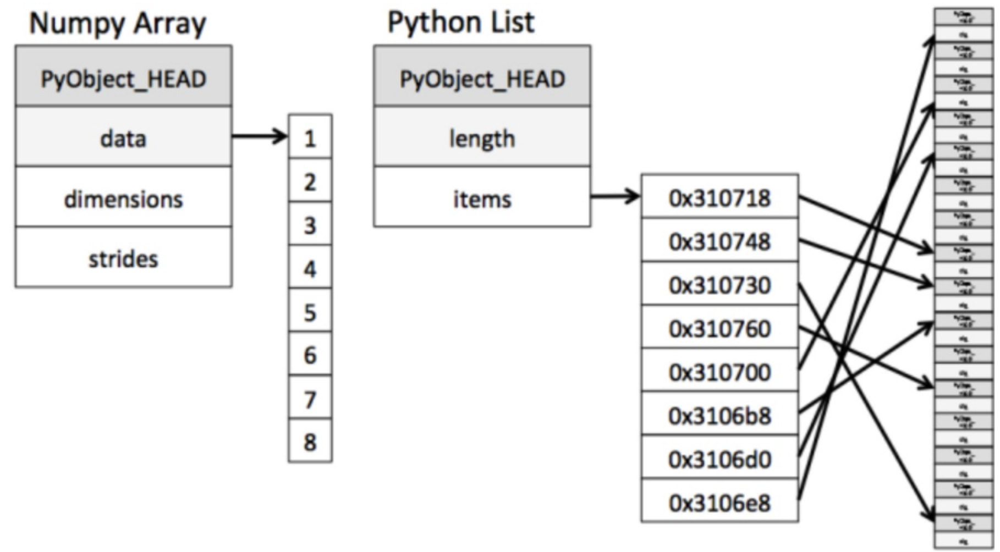

从图中我们可以看出 ndarray 在存储数据的时候，**数据与数据的地址都是连续的，且只能同时存储一个类型是数据**，这样就给使得批量操作数组元素时速度更快。而 Python 自带的 list 数据在内存中的位置是分散的，但是可以存储不同的数据

具体的解释：这是因为 ndarray 中的所有元素的类型都是相同的，而 Python 列表中的元素类型是任意的，所以 ndarray 在存储元素时内存可以连续，而 python 原生 list 就只能通过寻址方式找到下一个元素，这虽然也导致了在通用性能方面 Numpy 的 ndarray 不及 Python 原生 list，但**在科学计算中，Numpy 的ndarray 就可以省掉很多循环语句，代码使用方面比 Python 原生 list 简单的多**。


- **ndarray** 支持并行化运算(向量化运算)

    numpy内置了并行运算功能，当系统有多个核心时，做某种计算时，numpy会自动做并行计算

    

- 效率远高于纯 **Python** 代码

    Numpy底层使用C语言编写，内部解除了GIL(全局解释器锁)，其对数组的操作速度不受 Python 解释器的限制，所以，其效率远高于纯 Python 代码


## ndarray 的属性及方法


### numpy.dtype 类型

> 若不指定数据类型，整数默认 int64，小数默认 float64

`dtype` 是 `numpy.dtype` 类型

| 名称          | 描述                                             | 简写  |
| ------------- | ------------------------------------------------ | ----- |
| np.bool       | 用一个字节存储的布尔类型(True或False)            | 'b'   |
| np.int8       | 一个字节大小，-128 至 127                        | 'i'   |
| np.int16      | 整数，-32768 至 32767                            | 'i2'  |
| np.int32      | 整数，-2^31 至 2^32 -1                           | 'i4'  |
| np.int64      | 整数，-2^63 至 2^63 - 1                          | 'i8'  |
| np.uint8      | 无符号整数，0 至 255                             | 'u'   |
| np.uint16     | 无符号整数，0 至 65535                           | 'u2'  |
| np.uint32     | 无符号整数，0 至 2^32 - 1                        | 'u4'  |
| np.uint64     | 无符号整数，0 至 2^64 - 1                        | 'u8'  |
| np.float16    | 半精度浮点数:16位，正负号1位，指数5位，精度10位  | 'f2'  |
| np.float32    | 单精度浮点数:32位，正负号1位，指数8位，精度23位  | 'f4'  |
| np.float64    | 双精度浮点数:64位，正负号1位，指数11位，精度52位 | 'f8'  |
| np.complex64  | 复数，分别用两个32位浮点数表示实部和虚部         | 'c8'  |
| np.complex128 | 复数，分别用两个64位浮点数表示实部和虚部         | 'c16' |
| np.object_    | python对象                                       | 'O'   |
| np.string_    | 字符串                                           | 'S'   |
| np.unicode_   | unicode类型                                      | 'U'   |


​    

---


### 生成数组的方法

- **生成0和1的数组**

    | 方法                       | 描述 |
    | -------------------------- | ---- |
    | **`np.ones(shape=形状, dtype=数据类型)`** | `shape` 可以以列表或者元组的形式传入；`dtype` 可以指定数据类型 |
    | `np.ones_like(a=数组, dtype=数据类型)` | `a` 可以是 ndarray，生成和 `a` **形状一样的新** `ndarray` |
    | **`np.zeros(shape=形状, dtype=数据类型)`** |      |
    | `np.zeros_like(a=数组, dtype=数据类型)` |      |

    

- **从现有数组生成**

    > **这里深拷贝和浅拷贝只有在传入的数组是 np.ndarray ，并且数据类型一致时才有效**。如果传入的是 Python 自带的 list[] 类型，则两者都是深拷贝！
    
    | 方法                                          | 描述                                           |
    | --------------------------------------------- | ---------------------------------------------- |
    | `np.array(object=现有数组, dtype=数据类型)`   | **【深拷贝】**返回跟参数中的数组一样的 ndarray |
    | `np.copy(现有数组)`                           | **【深拷贝】**返回跟参数中的数组一样的 ndarray |
    | `np.asarray(object=现有数组, dtype=数据类型)` | **【浅拷贝】**返回跟参数中的数组一样的 ndarray |
    


- **生成固定范围的数组**

    - 创建**等差**数组 — **指定元素数量**

        生成数组内**指定元素数量**的**等差数组**

        *指定的 start-stop 区间为两侧闭区间：[start, stop]*

        ```python
        np.linspace(start=起始值, stop=结束值, num=要生成的等间隔样例数量，默认50, endpoint=序列中是否包含stop值，默认为ture)
        
        
        # 生成等间隔的数组
        np.linspace(0, 100, 11)
         
        >>> 返回结果:
        array([ 0., 10., 20., 30., 40., 50., 60., 70., 80., 90., 100.])
        ```

        

    - 创建**等差**数组 — **指定步长**

        根据**指定的步长**生成数组

        *指定的 start-stop 区间为左闭右开闭区间：[start, stop)*

        ```python
        np.arange(start=起始值, stop=结束值, step=步长、默认1, dtype=类型)
        
        
        np.arange(10, 50, 2)
            
        >>> 返回结果:
        array([10, 12, 14, 16, 18, 20, 22, 24, 26, 28, 30, 32, 34, 36, 38, 40, 42, 44, 46, 48])
        ```

        

    - 创建**等比**数列 — **指定元素数量**

        *指定的 start-stop 区间为 10^n 次方 两侧闭区间：[10^start, 10^stop]*

        ```python
        np.logspace(start=起始值10^start, stop=结束值10^stop, num=要生成的等比数列中元素的数量，默认为50)
        
        
        np.logspace(0, 2, 3)
        
        >>> 返回结果:
        array([  1.,  10., 100.])
        ```


- **生成随机数组**

    模块 API：

    ```python
    numpy.random
    ```

    - **生成随机数组**

        ```python
        np.random.uniform(low=最小值, high=最大值, size=数量)
        ```

        

    - **正态分布**

> **什么是正态分布？**
>
> 正态分布是一种概率分布。正态分布是具有两个参数 μ 和 σ 的连续型随机变量的分布，第一参数 μ 是服从正态分布的随机变量的均值，第二个参数 σ 是此随机变量的标准差，所以正态分布记作 **N(μ**，**σ)**。
>
> 
>
> **当μ = 0,σ = 1时的正态分布是标准正态分布**
>
> 
>
> - `μ` - 均值，在图像中反映为对称轴
>
> - `σ` - 标准差，标准差 **σ** 决定了分布的幅度
>
> - `σ^2` - 方差，理解为数据的分布密度；**方差越大数据越分散，方差越小数据越向均值集中**
>
>     方差是在概率论和统计方差衡量一组数据时**离散程度的度量**
>
>     
>
>     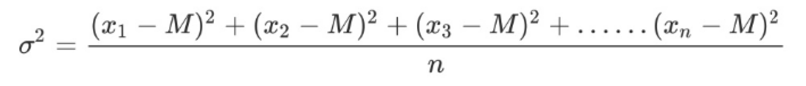
>
>     
>
>     其中M为平均值，n为数据总个数，σ 为标准差，σ^2 可以理解一个整体为方差
>            
>     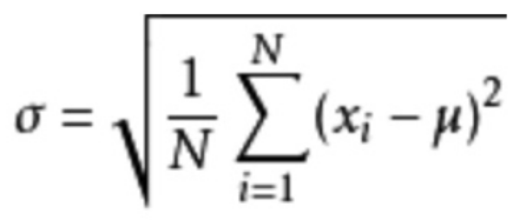
>
>     
>
>     
>
> 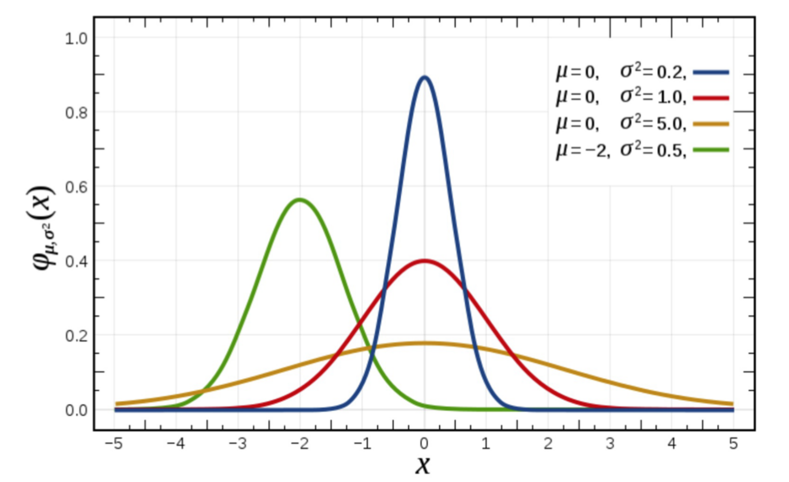
>
> 


- **正态分布**

    - **返创建并回指定形状的标准正态分布的数组**

        ```python
        np.random.standard_normal(size=数组形状)
        ```

        

    - **创建并返回指定均值和标准差的正态分布**

        ```python
        np.random.normal(loc=float类型的均值, scale=标准差, size=数组形状默认1)
        ```


---


### ndarray 的属性

| 属性名字           | 属性解释                                                     |
| ------------------ | ------------------------------------------------------------ |
| `ndarray.shape`    | 返回数组维度的**元组**，元组中一个元素代表一个维度，如果只有一个维度则用 `(n, )` 表示 |
| `ndarray.ndim`     | 返回数组维数                                                 |
| `ndarray.size`     | 返回数组中的元素数量                                         |
| `ndarray.itemsize` | 返回数组中一个元素的长度（字节）                             |
| `ndarray.dtype`    | 数组元素的类型                                               |


### 数组的索引、切片

一维、二维、三维的数组如何索引？

- 直接进行索引,切片
- 对象[:, :] -- 先行后列


二维数组索引方式：

- 举例：获取第一个股票的前3个交易日的涨跌幅数据

```python
# 二维的数组，两个维度 
stock_change[0, 0:3]
```

返回结果：

```python
array([-0.03862668, -1.46128096, -0.75596237])
```

- 三维数组索引方式：

```python
# 三维
a1 = np.array([ [[1,2,3],[4,5,6]], [[12,3,34],[5,6,7]]])
# 返回结果
array([[[ 1,  2,  3],
        [ 4,  5,  6]],

       [[12,  3, 34],
        [ 5,  6,  7]]])
# 索引、切片
>>> a1[0, 0, 1]   # 输出: 2
```


### 形状变换

| 方法                            | 描述                                                         |
| ------------------------------- | ------------------------------------------------------------ |
| `ndarray.reshape(shape, order)` | **只返回**一个具有相同数据域，但shape不一样的**新视图** ，源数组不进行变换<br />行、列不进行互换<br />也就是把数据分布到新的 shape 当中去<br />在转换形状的时候，一定要注意数组的元素匹配 |
| `ndarray.resize(new_shape)`     | 修改数组本身的形状（需要保持元素个数前后相同），无返回值 <br />行、列不进行互换 |
| `ndarray.T`                     | 数组的转置<br />将数组的行、列进行互换                       |
|                                 |                                                              |


### 类型的修改及数据的本地化

> **python 序列化数据本地存放**
>
> 序列化的概念很简单。内存里面有一个数据结构，你希望将它保存下来，重 用，或者发送给其他人。你会怎么做？嗯, 这取决于你想要怎么保存，怎么重用，发送给谁。很多游戏允许你在退出的时候保存进度，然后你再次启动的时候回到上次退出的地方。(实际上, 很多非游戏程序也会这么干。) 在这个情况下, 一个捕获了当前进度的数据结构需要在你退出的时候保存到磁盘上，接着在你重新启动的时候从磁盘上加载进来。这个数据只会被创建它的程序使用，不会发送到网 络上，也不会被其它程序读取。因此，互操作的问题被限制在保证新版本的程序能够读取以前版本的程序创建的数据。

| 方法                                                         | 描述                                                         |
| ------------------------------------------------------------ | ------------------------------------------------------------ |
| `ndarray.astype(type)`                                       | **只返回**修改了类型之后的数组，不修改原数组                 |
| `ndarray.tostring([order])` <br />或者<br />`ndarray.tobytes([order])` | (本地化数据) **只返回**构造包含数组中原始数据字节的Python字节 |
|                                                              |                                                              |


### 数组的去重

- 利用 Numpy 提供的方法进行直接去重

    ```python
    numpy.unique(ndarry数组)
    
    
    temp = np.array([[1, 2, 3, 4],[3, 4, 5, 6]])
    np.unique(temp)
    
    >>> 输出：
    array([1, 2, 3, 4, 5, 6])
    ```

    **返回**去重后的**数的数组**

    

    

- 利用将 `ndarray.flatten()` 先转换为一维数组，再利用 Python set集合的方式去重

    ```python
    set(ndarry.flatten())
    
    
    >>> 输出：
    array([1, 2, 3, 4, 5, 6])
    ```

    **返回**去重后的**数的集合**


### 小结

- 创建数组【掌握】
    - 生成0和1的数组
        - `np.ones()`
        - `np.ones_like()`
    - 从现有数组中生成
        - `np.array` -- 深拷贝
        - `np.asarray` -- 浅拷贝
    - 生成固定范围数组
        - `np.linspace()`
            - nun -- 生成**等间隔**的多少个
        - `np.arange()`
            - step -- 每间隔多少生成数据
        - `np.logspace()`
            - 生成以10的N次幂的数据
    - 生层随机数组
        - 正态分布
            - 里面需要关注的参数:均值:u, 标准差:σ
                - u -- 决定了这个图形的左右位置
                - σ -- 决定了这个图形是瘦高还是矮胖
            - `np.random.randn()`
            - `np.random.normal(0, 1, 100)`
        - 均匀
            - `np.random.rand()`
            - `np.random.uniform(0, 1, 100)`
            - `np.random.randint(0, 10, 10)`
- 数组索引【知道】
    - 直接进行索引,切片
    - 对象[:, :] -- 先行后列
- 数组形状改变【掌握】
    - `对象.reshape()`
        - 没有进行行列互换,新产生一个ndarray
    - `对象.resize()`
        - 没有进行行列互换,修改原来的ndarray
    - `对象.T`
        - 进行了行列互换
- 数组去重【知道】
    - `np.unique(对象)`


## ndarry 运算

### 逻辑运算

```python
# 生成10名同学，5门功课的数据
>>> score = np.random.randint(40, 100, (10, 5))

# 取出最后4名同学的成绩，用于逻辑判断
>>> test_score = score[6:, 0:5]

# 逻辑判断, 如果成绩大于60就标记为True 否则为False
>>> test_score > 60
array([[ True,  True,  True, False,  True],
       [ True,  True,  True, False,  True],
       [ True,  True, False, False,  True],
       [False,  True,  True,  True,  True]])

# 【重点】BOOL赋值, 将满足条件的设置为指定的值-布尔索引
>>> test_score[test_score > 60] = 1
>>> test_score
array([[ 1,  1,  1, 52,  1],
       [ 1,  1,  1, 59,  1],
       [ 1,  1, 44, 44,  1],
       [59,  1,  1,  1,  1]])
```


### 通用判断函数

- `no.all(布尔表达式)`

    只有所有的元素满足才返回 true

    ```python
    # 判断前两名同学的成绩是否全及格
    np.all(source[0:2, :] > 60)
    ```

    

- `np.any(布尔表达式)`

    只有要有一个元素满足就返回 true

    ```python
    # 判断前两名同学的成绩[0:2, :]是否有大于 90 分的
    np.any(source[0:2, :] > 90)
    ```

    

### 三元运算符及复合逻辑

- `np.where(布尔表达式, 布尔值为True设置的值, 布尔值为False设置的值)` **返回**新的数组

    ```python
    # 通过使用 np.where 能够进行更加复杂的运算
    # 判断前 4 名学生，前 3 门课程中，成绩中大于 60 的置为 1，否则为 0
    
    temp = source[:4, :3]
    np.where(temp > 60, 1, 0)
    ```

    

    

- 复合逻辑需要结合 `np.logical_and`、 `np.logical_or` 、`np.logical_not` 使用

    格式：`np.logical_and/or/not(布尔表达式1, 布尔表达式2, )`

    ```python
    # 判断前 4 名学生，前 3 门课程中，成绩中大于 60【且】小于 90 的换为 1，否则为 0
    np.where(np.logical_and(temp > 60, temp < 90), 1, 0)
    
    # 判断前 4 名学生，前 3 门课程中，成绩中大于 60【或】小于 90 的换为 1，否则为 0
    np.where(np.logical_or(temp > 60, temp < 90), 1, 0)
    ```


---


### 统计指标

获取数组的最小值、最大值、平均值、中位数等，可以使用:

- `Numpy.函数名(ndarry, axis=按哪一坐标轴)` 如果不指明具体按哪个 axis，那么就是整个数组

- `ndarry.方法名(axis=按哪一坐标轴)` 如果不指明具体按哪个 axis，那么就是整个数组


- **按 `Numpy.函数名(ndarry, axis=按哪一坐标轴)` 的方式**

    | 函数名                         | 描述         |
    | ------------------------------ | ------------ |
    | `np.min(ndarry, axis)`         | 最小值       |
    | `np.max(ndarry, axis)`         | 最大值       |
    | `np.median(ndarry, axis)`      | 中位数       |
    | `np.mean(ndarry, axis, dtype)` | 平均数       |
    | `np.std(ndarry, axis, dtype)`  | 标准差       |
    | `np.var(ndarry, axis, dtype)`  | 方差         |
    | `np.argmax(ndarry, axis)`      | 最大值的下标 |
    | `np.argmin(ndarry, axis)`      | 最小值的下标 |

    ```python
    源数据：
    array([[ 0.94392597, -0.2579331 ,  1.17741713,  0.91106463],
           [-0.22480532, -2.17304257,  0.06689428,  0.20691028],
           [-0.03596233, -0.59718032, -1.23148979, -0.62469026],
           [ 0.58676196, -2.00826884, -0.322707  , -1.02992438]])
    
    
    # 用 Numpy.函数名(ndarry, axis=按哪一坐标轴) 的方式：
    np.min(tmp)
    >>> -2.17304256830656
    
    np.min(tmp, axis=0)  # 这时 axis=0 代表按列，返回每一列的最小值
    >>> array([-0.22480532, -2.17304257, -1.23148979, -1.02992438])
    
    np.median(tmp)
    >>> -0.24136921361245312
    ```

    


- **按 `Numpy.函数名(ndarry, axis=按哪一坐标轴)` 的方式**

    | 函数名                         | 描述   |
    | ------------------------------ | ------ |
    | `ndarry.min(axis)`         | 最小值 |
    | `ndarry.max(axis)`         | 最大值 |
    | `ndarry.median(axis)`      | 中位数 |
    | `ndarry.mean(axis, dtype)` | 平均数 |
    | `ndarry.std(axis, dtype)`  | 标准差 |
    | `ndarry.var(axis, dtype)`  | 方差   |
    | `ndarry.argmax(axis)` | 最大值的下标 |
    | `ndarry.argmin(axis)` | 最小值的下标 |

    ```python
    源数据：
    array([[ 0.94392597, -0.2579331 ,  1.17741713,  0.91106463],
           [-0.22480532, -2.17304257,  0.06689428,  0.20691028],
           [-0.03596233, -0.59718032, -1.23148979, -0.62469026],
           [ 0.58676196, -2.00826884, -0.322707  , -1.02992438]])
    
    
    # 用 `ndarry.方法名(axis=按哪一坐标轴)` 的方式：
    tmp.min()
    >>> -2.17304256830656
    
    tmp.min(axis=1)
    >>> array([-0.2579331 , -2.17304257, -1.23148979, -2.00826884])
    ```

    


## 数组间运算

### 数组与数的运算

直接**用一个 ndarry 加减乘除 另一个数，会作用于 ndarry 中的每一个元素**


例子：

```python
arr = np.array([[1, 2, 3, 2, 1, 4], [5, 6, 1, 2, 3, 1]])

arr + 1
>>> array([[2, 3, 4, 3, 2, 5],
       [6, 7, 2, 3, 4, 2]])

arr / 2
>>> array([[0.5, 1. , 1.5, 1. , 0.5, 2. ],
       [2.5, 3. , 0.5, 1. , 1.5, 0.5]])

```


### broadcast 广播机制

**【重点】**数组在进行矢量化运算（element-wise）时，**要求 ndarry 数组的形状是相等的**。当形状不相等的数组执行算术运算的时候，就会出现广播机制，该机制会对数组进行扩展，使数组的 shape 属性值一样，这样，就可以进行矢量化运算了。


**运算的数组之间满足以下任意的一个条件时才能进行运算：**

- 对应维度的元素数量相同（维度等长）
- 对应维度的元素数量有一个数组的是 1（shape）


广播机制需要**扩展维度小的数组**，使得它与维度最大的数组的shape值相同，以便使用元素级函数或者运算符进行运算。

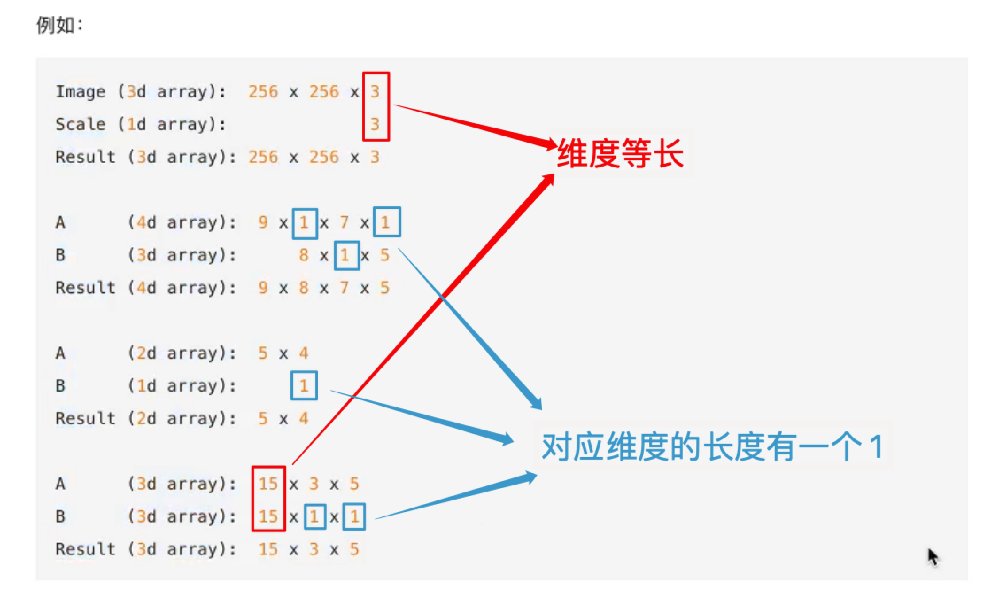


### 矩阵和向量

#### 矩阵

矩阵，英文matrix，**和array的区别矩阵必须是2维的，但是array可以是多维的。**

如图:这个是 3×2 矩阵，即 3 行 2 列，如 m 为行，n 为列，那么 m×n 即 3×2

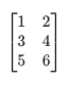

**矩阵的维数即行数×列数**

矩阵元素(矩阵项):

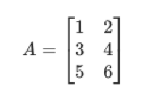

$A_{ij}$ 指第 i 行，第 j 列的元素。


---


#### 向量

**向量是一种特殊的矩阵**，讲义中的向量一般都是列向量，下面展示的就是三维列 向量(3×1)

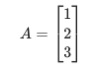


---


#### 加法和标量乘法

- 矩阵的加法:**行列数相等的可以加。**

    例:

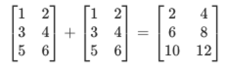

- 矩阵的乘法:每个元素都要乘。

    例:

    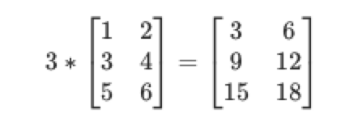

    组合算法也类似

    

---


#### 矩阵向量乘法

矩阵和向量的乘法如图：m×n 的矩阵乘以 n×1 的向量，得到的是 m×1 的向量

例:

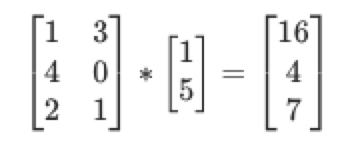

```
1*1+3*5 = 16
4*1+0*5 = 4
2*1+1*5 = 7
```

**矩阵乘法遵循准则：**

**(M行, N列)\*(N行, L列) = (M行, L列)**


---


#### 矩阵乘法

矩阵乘法：

m×n 矩阵乘以 n×l 矩阵，变成 m×l 矩阵。

举例：比如说现在有两个矩阵 A 和 B，那 么它们的乘积就可以表示为图中所示的形式。

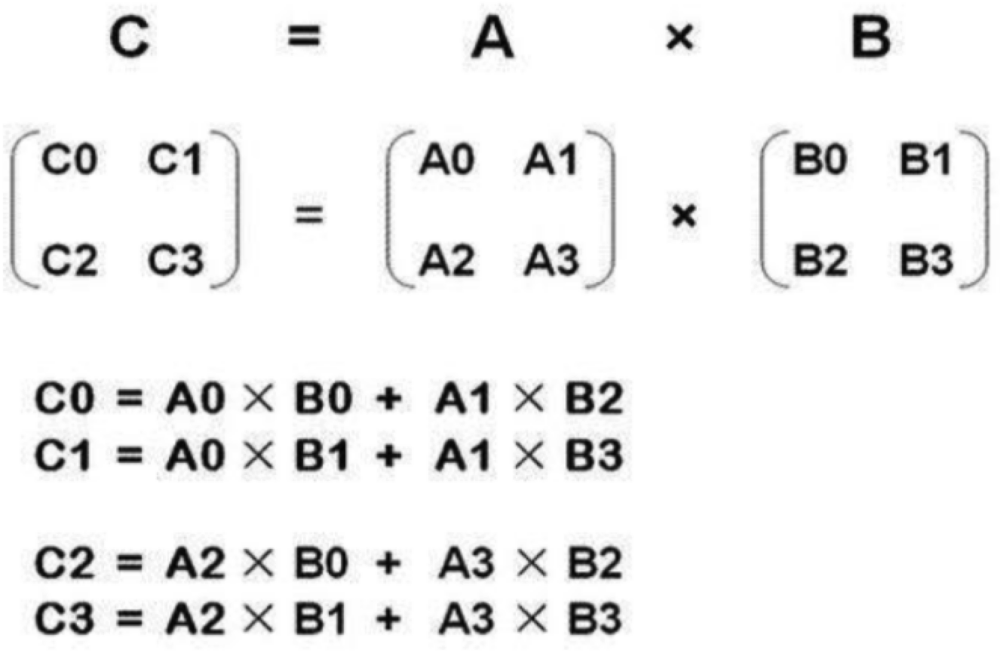


例：

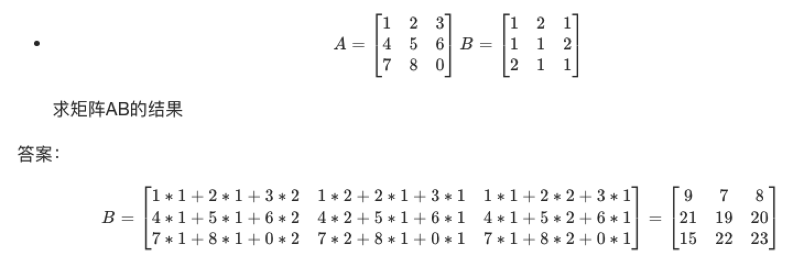


---


#### 矩阵乘法的性质

矩阵的乘法不满足交换律：A×B≠B×A

矩阵的乘法满足结合律。即：A×（B×C）=（A×B）×C

单位矩阵：在矩阵的乘法中，有一种矩阵起着特殊的作用，如同数的乘法中的 1，我们称这种矩阵为**单位矩阵**。它是个方阵，一般用 I 或者 E 表示，从 左上角到右下角的对角线（称为主对角线）上的元素均为 1 以外全都为 0。

如：

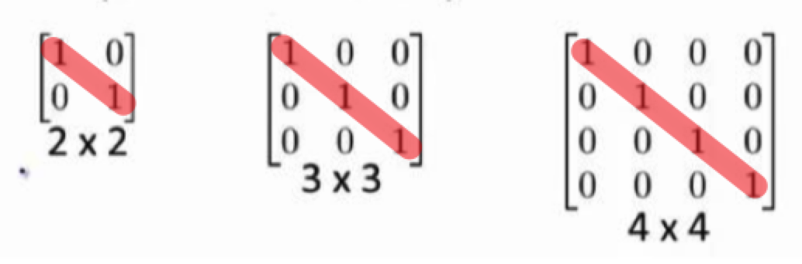


---


#### 逆、转置

矩阵的逆：如矩阵 A 是一个 m×m 矩阵（方阵），如果有逆矩阵，则：

$$ AA^{-1} = A^{-1}A = I $$


**低阶矩阵求逆的方法:**

 1.待定系数法

 2.初等变换


**矩阵的转置：**

设 A 为 m×n 阶矩阵（即 m 行 n 列），第 i 行 j 列的元素是 a(i,j)，即：A=a(i,j)

定义 A 的转置为这样一个 n×m 阶矩阵 B，满足 B=a(j,i)，即 b(i,j)=a(j,i)（B 的第 i 行第 j 列元素是 A 的第 j 行第 i 列元素），记 AT =B。

直观来看，将 A 的所有元素绕着一条从第 1 行第 1 列的元素出发的右下方 45 度的射线作镜面反转，即得到 A 的转置。

例：

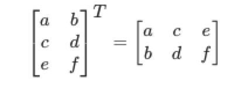


---


#### 矩阵运算

假设我们拥有学生的平均成绩和期末成绩，但学生的最终成绩是按照平时成绩和最终成绩加权得到的，平时成绩占 30%、期末成绩占 70%

也就是说：

最终成绩 = (平时成绩 * 0.3) + (最终成绩 * 0.7)

我们可以使用矩阵运算的形式得到所需的结果：

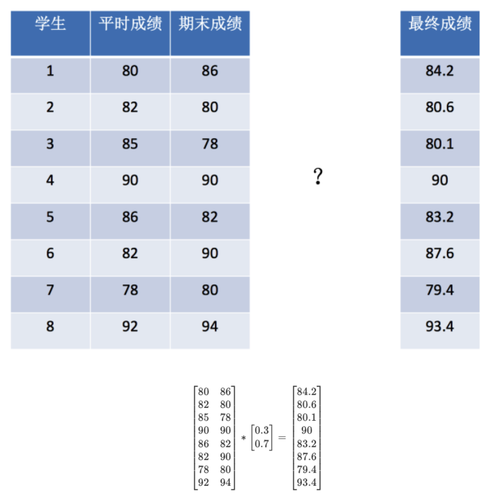


#### 矩阵 API

- **定义一个矩阵**

    `Numpy.mat(列表形式的数据或 ndarry)` **返回** Numpy 类型的矩阵；mat 代表 **mat**rix

    

- **矩阵的乘法**

    - `矩阵1 * 矩阵2`
    - `np.matmul(矩阵1, 矩阵2)`

    - `np.dot(矩阵1, 矩阵2)`

    

    **`np.matmul(矩阵1, 矩阵2)` 和 `np.dot(矩阵1, 矩阵2)` 的区别:**

    二者都是矩阵乘法。 `np.matmul(矩阵1, 矩阵2)` 中**禁止矩阵与标量的乘法**。 

    在矢量乘矢量的內积运算中，`np.matmul(矩阵1, 矩阵2)` 与 `np.dot(矩阵1, 矩阵2)` 没有区别。


- **在 ndarry 不转换为矩阵的形式下进行矩阵运算：**

    有时候如果是通过 ndarry 的方式直接相乘，是不可以的，比如 (8, 2) 和 (1, 2) 不符合广播机制！所以不能进行运算

    但是可以使用运算符 `@` 的进行相乘（矩阵相乘）！

    `数组1 @ 数组2`


```python
# 学生成绩
mark_stu = np.array([[80, 86],
[82, 80],
[85, 78],
[90, 90],
[86, 82],
[82, 90],
[78, 80],
[92, 94]])

# 权重
weight = np.array([[0.3], [0.7]])

# 转换为矩阵
matrix_mark_stu = np.mat(mark_stu)
matrix_weight = np.mat(weight)

# 矩阵1 * 矩阵2
matrix_mark_stu * matrix_weight

# 矩阵乘法 `np.matmul(矩阵1, 矩阵2)`
np.matmul(matrix_mark_stu, matrix_weight)

# 矩阵乘法 `np.dot(矩阵1, 矩阵2)` 
np.dot(matrix_mark_stu, matrix_weight)

# 如果是通过 ndarry 的方式直接相乘，是不可以的，因为 (8, 2) 和 (1, 2) 不符合广播机制！所以不能进行运算
# 但是可以使用运算符 `@` 的进行相乘（矩阵相乘）！
mark_stu @ weight


>>> array([[84.2],
       [80.6],
       [80.1],
       [90. ],
       [83.2],
       [87.6],
       [79.4],
       [93.4]])
```


---


### 合并、分割

- **数组的合并**

| 函数                                                       | 描述                            |
| ---------------------------------------------------------- | ------------------------------- |
| `Numpy.hstack(ndarry1, ndarry2 ...)`                       | 横向拼接                        |
| `Numpy.vstack(ndarry1, ndarry2 ...)`                       | 竖向拼接                        |
| `Numpy.concatenate((ndarry1, ndarry2 ...), axis=按哪个轴)` | 按指定的 int 类型的 axis 轴拼接 |

示例：

```python
# `Numpy.hstack(ndarry1, ndarry2 ...)` 
# 注意参数的括号
l = np.array((1, 2, 3))
r = np.array((4, 5, 6))
np.hstack((l, r))

>>> array([1, 2, 3, 4, 5, 6])


l = np.array([[1], [2], [3]])
r = np.array([[4], [5], [6]])
np.hstack((l, r))

>>> array([[1, 4],
       [2, 5],
       [3, 6]])

""""""""""""""""""""""""""""""""""""""""""""""""
# `Numpy.vstack(ndarry1, ndarry2 ...)` 
# 注意参数的括号
l = np.array((1, 2, 3))
r = np.array((4, 5, 6))
np.vstack((l, r))

>>> array([[1, 2, 3],
       [4, 5, 6]])


l = np.array([[1], [2], [3]])
r = np.array([[4], [5], [6]])
np.vstack((l, r))

>>> array([[1],
       [2],
       [3],
       [4],
       [5],
       [6]])

""""""""""""""""""""""""""""""""""""""""""""""""
# `Numpy.concatenate((ndarry1, ndarry2 ...), axis=按哪个轴)`
l = np.array([[1, 2], [3, 4]])
r = np.array([[5, 6]])

# 沿着 x 轴合并
np.concatenate((l, r), axis=0)

>>> array([[1, 2],
       [3, 4],
       [5, 6]])

# 沿着 y 轴合并
np.concatenate((l, r.T), axis=1)

>>> array([[1, 2, 5],
       [3, 4, 6]])
```


- **数组的分割**

    `Numpy.split(ndarry, 数或索引数组)` 

    - 如果第二个参数为数则切分成**等分**

        ```python
        arr = np.arange(9.0)
        arr
        >>> array([0., 1., 2., 3., 4., 5., 6., 7., 8.])
        
        # 等分为 3 份
        np.split(arr, 3)
        >>> [array([0., 1., 2.]), array([3., 4., 5.]), array([6., 7., 8.])]
        ```

        

    - 如果为数组则按数组中的**索引切分**，区间为左闭右开

        ```python
        arr = np.arange(9.0)
        arr
        >>> array([0., 1., 2., 3., 4., 5., 6., 7., 8.])
        
        # 按照数组中的索引切分，区间为左闭右开
        np.split(arr, [3, 5, 6, 10])
        >>> 
        [array([0., 1., 2.]),
         array([3., 4.]),
         array([5.]),
         array([6., 7., 8.]),
         array([], dtype=float64)]
        ```

        


---


## IO 操作

注意：Numpy 只要是一个数据操作的工具，文件的读取或者处理不是非常好。建议使用 Pandas 进行操作，Pandas 里也内置了 Numpy


- **读取操作 API：**

    ```python
    np.genfromtxt('文件路径', delimiter='分隔符')
    ```

    


- **什么是缺失值**

    Numpy 无法处理字符串，当读取字符串或者有缺失值的时候，反映到 ndarry 上就是 `nan`，`nan` 的类型是 numpy.float64

    


- **如何处理缺失值**
    - 直接删除具有缺失值的数据
    - 插补法把缺失值填补（平均值或中位数）


# Pandas


## 简介

- **Pandas 名字的解释：**
    - pan - pandel - 面板
    - da - data
    - panel 面板数据，来源于计量经济学，用于处理三维数据


- **特点**
    - 以 Numpy为基础，借力 Numpy 模块在计算方面性能高的优势
    - 基于 matplotlib，能够简便的画图
    - 独特的数据结构


- **为什么使用 Pandas**

    Numpy 已经能够帮助我们处理数据，结合 matplotlib 解决部分数据展示等问题

    - 便捷的数据处理能力（比如处理 nan 值）
    - 读取文件方便（可以读取多种数据类型的数据）
    - 封装了 Matplotlib 和 Numpy 的画图和计算


